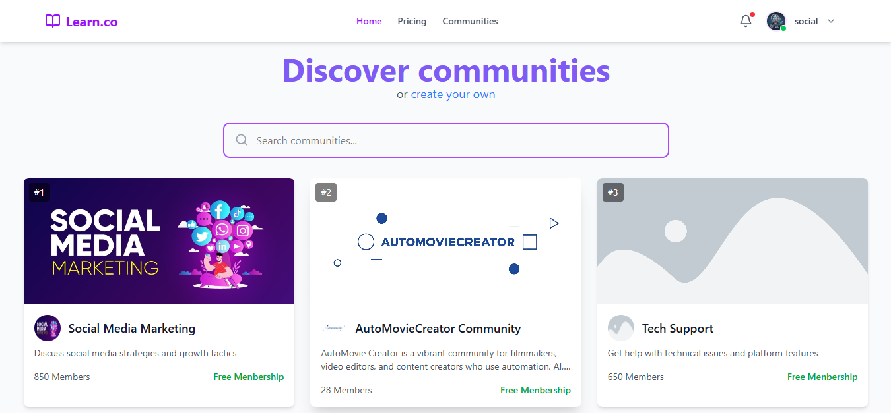
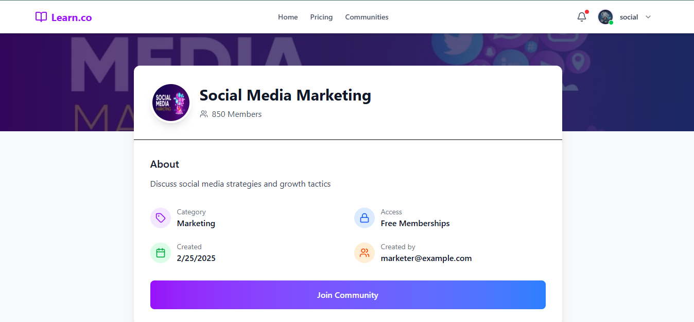
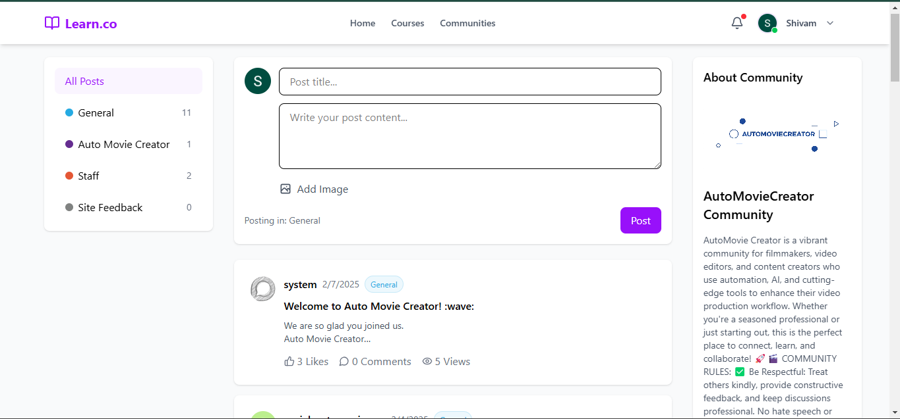

# Learn.co - Discourse Community Platform



Learn.co is a modern community platform inspired by Skool.com, designed to connect like-minded individuals through interest-based communities. The platform allows users to discover, join, and engage with communities, participate in discussions, access courses, and attend live streams.

## Features

### User Authentication
- Google Sign-In integration
- Protected routes for authenticated users
- Seamless redirection after authentication

### Community Discovery


- Browse and search available communities
- View community details including member count and description
- Join communities of interest

### Community Engagement


- Discussion forums powered by Discourse integration
- Create, view, and interact with posts
- Like and comment on discussions
- Category-based filtering of topics

### Learning Resources
- Access community-specific courses
- Structured learning paths
- Course creation and management (for community creators)

### Live Streaming
- Schedule and join live events
- Real-time interaction using Agora SDK
- Calendar view for upcoming streams

### Community Management
- Create and customize communities
- Manage community members
- Track engagement through leaderboards

## Tech Stack

### Frontend
- React 19 with Vite
- React Router v7 for navigation
- Tailwind CSS for styling
- Framer Motion for animations
- Lucide React for icons

### Authentication
- Firebase Authentication
- Google OAuth integration

### Real-time Communication
- Agora RTC SDK for live streaming

### State Management
- React Context API

### API Integration
- Axios for HTTP requests
- Discourse API integration for forums

## Getting Started

### Prerequisites
- Node.js (v16 or higher)
- npm or yarn

### Installation

1. Clone the repository
```bash
git clone https://github.com/yourusername/learngroup-live.git
cd learngroup-live/client
```

2. Install dependencies
```bash
npm install
```

3. Start the development server
```bash
npm run dev
```

4. Open your browser and navigate to `http://localhost:5173`

## Project Structure
```
📂 LearnGroup
├── 📂 Client (Frontend) [main branch]
│   ├── public/
│   ├── src/
│   ├── package.json
│   ├── .env
│   └── README.md
│
└── 📂 Server (Backend) [backend branch]
    ├── src/
    ├── config/
    ├── package.json
    ├── .env
    └── README.md
```

## Installation & Setup

### 1️⃣ Clone the Repository
```bash
git clone https://github.com/techautomoviecreatorcom/Learn.co.git
```

### 2️⃣ Setting Up the Client (Frontend)
```bash
git checkout main
cd client
npm install
npm start
```

### 3️⃣ Setting Up the Server (Backend)
```bash
git checkout backend
cd server
npm install
npm start
```

## Discourse Server Setup

This platform integrates with Discourse for community discussions. You'll need to set up a Discourse server on your local machine:

### Setting Up Discourse Server

#### Option 1: Linux or WSL (Ubuntu)
1. Install Docker and Docker Compose
   ```bash
   sudo apt-get update
   sudo apt-get install docker.io docker-compose
   ```

2. Clone the Discourse Docker repository
   ```bash
   git clone https://github.com/discourse/discourse_docker.git
   cd discourse_docker
   ```

3. Copy the sample configuration
   ```bash
   cp samples/standalone.yml containers/app.yml
   ```

4. Edit the configuration file
   ```bash
   nano containers/app.yml
   ```
   - Set DISCOURSE_DEVELOPER_EMAILS to your email
   - Configure DISCOURSE_HOSTNAME to your local domain (e.g., discourse.local)
   - Update other settings as needed

5. Bootstrap Discourse
   ```bash
   ./launcher bootstrap app
   ```

6. Start Discourse
   ```bash
   ./launcher start app
   ```

7. Access your Discourse instance at http://localhost:80 or the hostname you configured

#### Option 2: Windows (without WSL)
1. Install Docker Desktop for Windows
2. Enable Hyper-V (required for Docker)
3. Follow the same steps as Linux installation using PowerShell

### Connecting to the Platform
1. After setting up Discourse, obtain your API key:
   - Log in as an admin
   - Go to Admin > API
   - Create a new API key with global permissions

2. Update your .env file with Discourse settings:
   ```
   DISCOURSE_URL=http://localhost:80
   DISCOURSE_API_KEY=your_api_key
   DISCOURSE_API_USERNAME=system
   ```

For more detailed instructions, refer to the [official Discourse documentation](https://github.com/discourse/discourse/blob/main/docs/INSTALL.md).

## Contribution Guidelines
1. Fork the repository.
2. Create a new branch for your feature: `git checkout -b feature-name`
3. Commit your changes: `git commit -m "Added new feature"`
4. Push to the branch: `git push origin feature-name`
5. Open a Pull Request.

## License
This project is licensed under the MIT License.